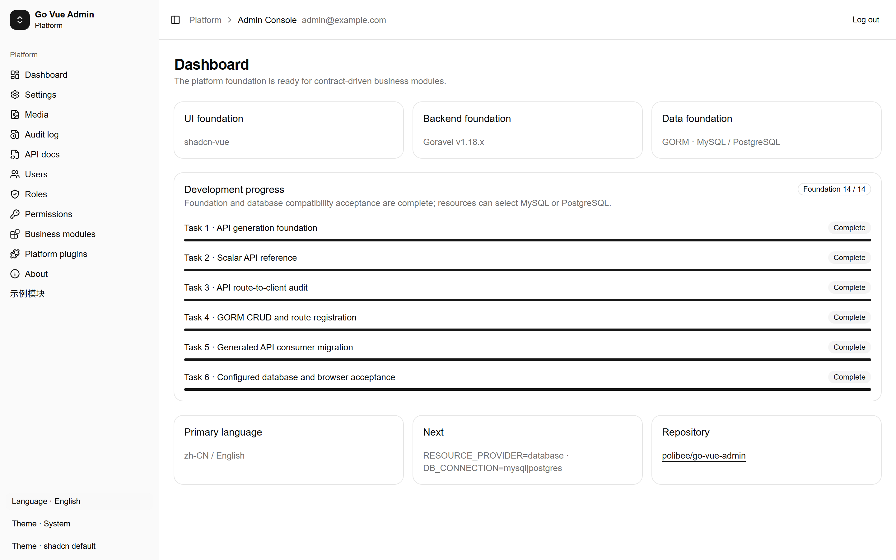
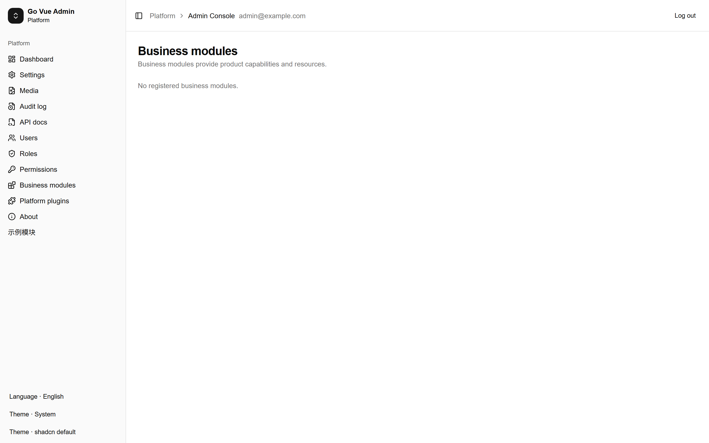
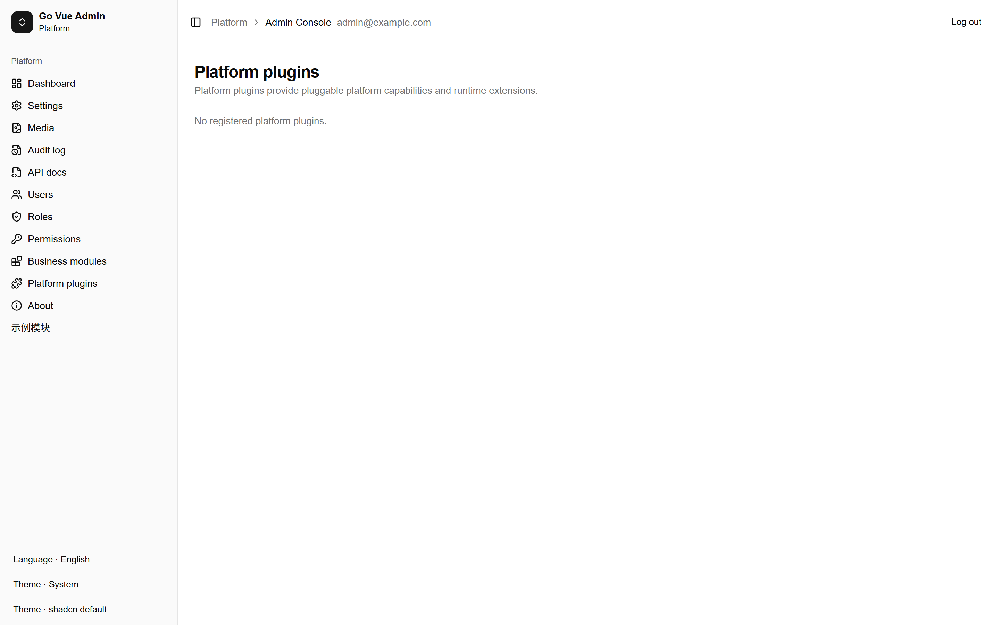
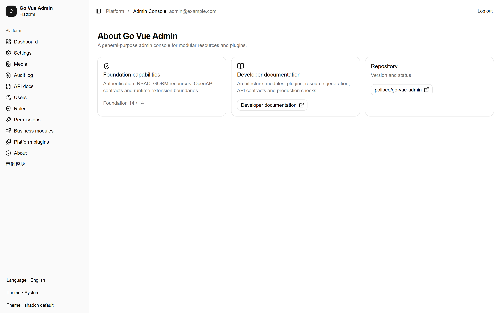

# Go Vue Admin

Go Vue Admin is a modular administration foundation built with Go/Goravel, Vue 3, shadcn-vue, GORM and OpenAPI contracts.

It provides HttpOnly session authentication, RBAC, generic CRUD resources, runtime modules and plugins, generated API contracts, Scalar API reference, MySQL/PostgreSQL selection and an isolated developer documentation site.

## Current status

Foundation capabilities are complete and the project is ready for controlled internal development. Before production launch, complete identity integration, secret management, HTTPS, backup/restore drills, rate limiting, upload scanning, monitoring and deployment rollback procedures.

## Quick start

Use Go 1.27, Node.js 24 and pnpm 10:

    $env:APP_ENV = "local"
    $env:APP_KEY = "replace-with-a-32-character-dev-key"
    $env:AUTH_BOOTSTRAP_EMAIL = "admin@example.com"
    $env:AUTH_BOOTSTRAP_PASSWORD = "test-only-password"
    $env:RESOURCE_PROVIDER = "memory"
    go -C backend run .

Start the admin:

    pnpm --dir admin run dev -- --host 0.0.0.0

Open http://127.0.0.1:5173/login. The admin defaults to the HTTP Resource Provider so CRUD data survives a browser reload through the backend. Use RESOURCE_PROVIDER=database and DB_CONNECTION=mysql|postgres for real database resources.

## Developer documentation

The English-first documentation site is isolated in docs-site/ and does not participate in the admin or backend build:

    node docs-site/scripts/build.mjs

Online documentation: <https://go-vue-admin.github.io/>

The root documentation is English. Simplified Chinese is available under /zh-CN/. GitHub Pages deployment is manual-only and does not run on normal pushes.

## Architecture for AI agents

Read AGENTS.md, docs-site/src/content/en/architecture.md, docs-site/src/content/en/getting-started.md, and the relevant module or plugin manifest before editing code. Reuse the Resource Engine, application-owned GORM pool, OpenAPI contract and Runtime Registration Bridge. Generated clients and schemas must be regenerated rather than edited by hand.

This project is developed and maintained entirely by OpenAI Codex. Repository source, tests and documentation are the source of truth for implementation decisions.

## Screenshots

These screenshots were captured from the English admin interface at 1440×900 with a device scale factor of 2:

## Themes and languages

The admin supports Simplified Chinese and English. Theme mode supports light, dark and system. Palette presets include shadcn default, Semi Design, TDesign and WeChat. Presets only override semantic CSS variables and do not change the underlying shadcn-vue components.

## License and development notice

OpenAI Codex is the sole development agent for this repository. Contributions should preserve the modular boundaries, update contracts and include focused tests.
