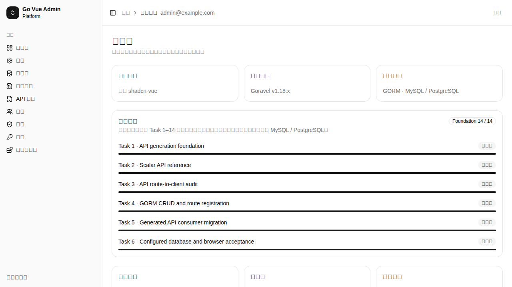
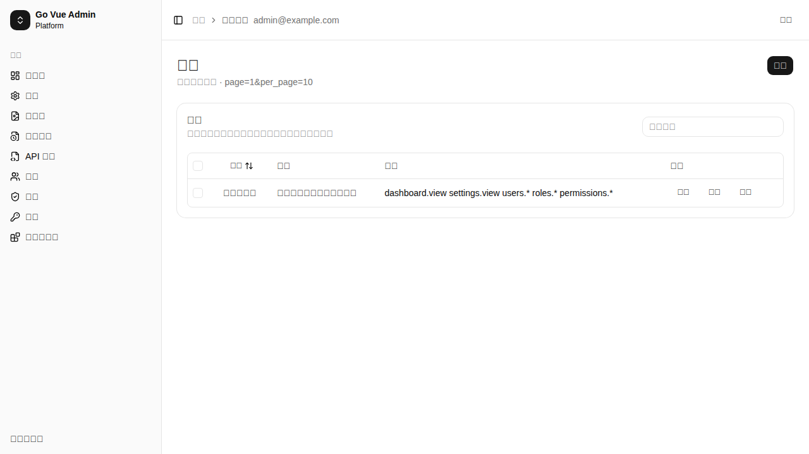
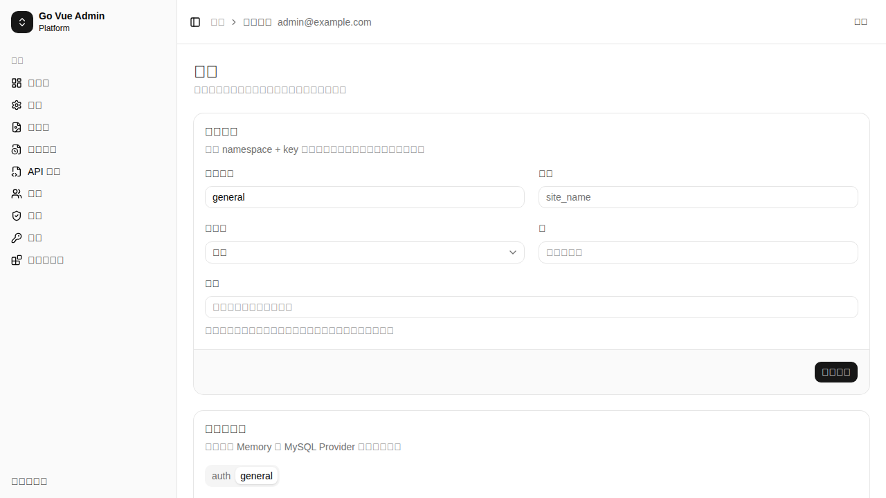
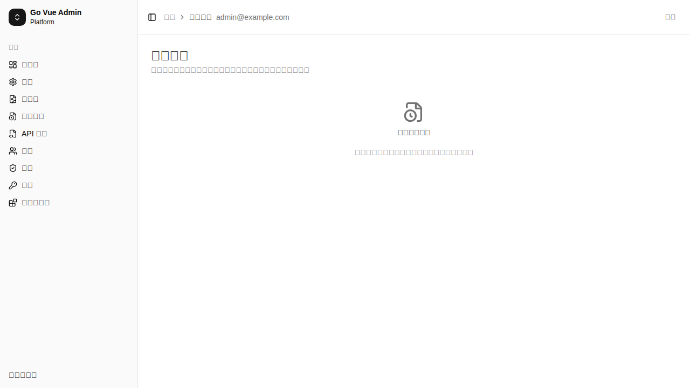

# Go Vue Admin

通用后台管理面板，采用 Go/Goravel 后端、Vue 3 + shadcn-vue 管理端，并以模块、资源定义和 OpenAPI 契约作为开发边界。

## 当前开发状态

当前处于 API 生成与审计计划的 Task 6：可配置数据库集成和浏览器验收。

- 登录、Cookie/HttpOnly Session、RBAC、动态导航已完成。
- 通用资源列表、新建、详情、编辑、删除和批量删除已完成。
- admin-gen api 统一生成 OpenAPI、Schema 和管理端 TypeScript API Client。
- Scalar API 文档位于 /admin/api-docs。
- 角色 platform-admin 详情接口和后台页面已纳入回归验收。
- 资源层已统一使用 GORM；通过 `DB_CONNECTION=mysql|postgres` 选择底层数据库，应用迁移和资源连接池使用同一选择。

## 本地启动

后端需要 32 字符的 APP_KEY。开发环境可以通过环境变量提供临时密钥：

    $env:APP_ENV = "local"
    $env:APP_KEY = "replace-with-a-32-character-dev-key"
    $env:AUTH_BOOTSTRAP_EMAIL = "admin@example.com"
    $env:AUTH_BOOTSTRAP_PASSWORD = "test-only-password"
    $env:RESOURCE_PROVIDER = "memory"
    go -C backend run .

管理端会自动探测 3003、3000、3001、3002，也可以显式设置 VITE_BACKEND_PORT 或 VITE_BACKEND_URL：

    pnpm --dir admin run dev -- --host 0.0.0.0

默认访问地址是 http://127.0.0.1:5173/login。

## Provider

默认使用内存资源 Provider，适合单元测试、演示和无数据库开发：

    RESOURCE_PROVIDER=memory
    VITE_RESOURCE_PROVIDER=memory

真实资源 API 使用独立的应用级 GORM 连接池。启用数据库模式，并将 `DB_CONNECTION` 设置为实际可用的数据库：

    RESOURCE_PROVIDER=database
    DB_CONNECTION=mysql
    VITE_RESOURCE_PROVIDER=http

PostgreSQL 示例：

    RESOURCE_PROVIDER=database
    DB_CONNECTION=postgres
    DB_HOST=127.0.0.1
    DB_PORT=5432
    DB_DATABASE=go_vue_admin
    DB_USERNAME=postgres
    DB_PASSWORD=

旧配置 `RESOURCE_PROVIDER=mysql` 仅作为兼容别名保留，新项目请使用 `RESOURCE_PROVIDER=database`。不要在未确认目标数据库和凭据的情况下运行迁移或破坏性 CRUD 验收。

## 后台预览

以下截图来自本地浏览器验收，展示当前后台的主要页面：

登录页的开发账号仅在本地开发环境显示，不放入公开文档截图。

## 验证命令

    go -C backend test ./...
    pnpm run test
    pnpm run typecheck
    pnpm run build
    pnpm run release:check

GitHub Actions 保持手动触发；本地模块验收不会自动触发远程 CI。
